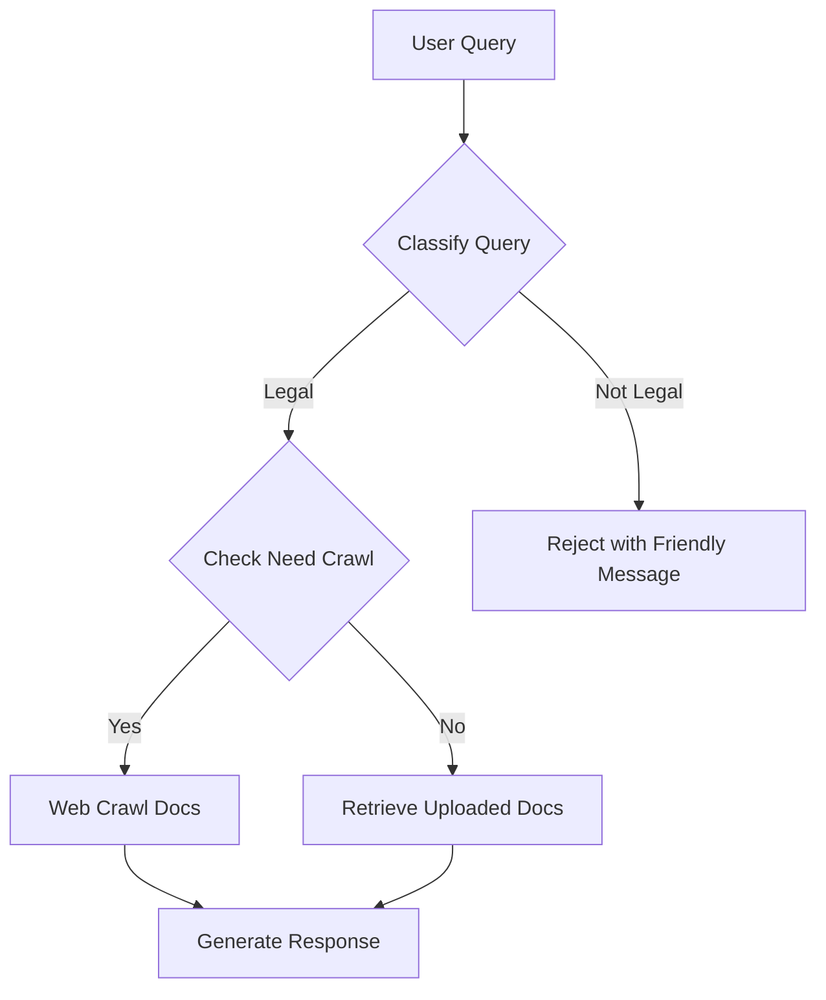

# Land Law Assistant API

A multilingual legal assistant system that answers legal queries using uploaded legal documents and real-time government website crawling. It also provides synchronized audio and lipsync animation output for each response chunk.

## Features

- **Legal Query Classification**
- **Document Retrieval (RAG)**
- **Web Crawling for Government Legal Docs**
- **Streaming Text + Audio Response**
- **Text-to-Speech (TTS) + Lipsync**
- **PDF Upload + Processing**
- **Multilingual Support (Vietnamese ↔ English)**

## Tech Stack

- **FastAPI** - Web framework
- **LangGraph + LangChain** - RAG & tool-based agent
- **OpenAI GPT-4o-mini** - Language model
- **Pinecone** - Vector database
- **Google Translator + langid** - Language detection & translation
- **gTTS + FFmpeg + Rhubarb** - Text-to-Speech and Lipsync
- **BeautifulSoup + Requests** - Crawling legal content from government websites

## Setup

### 1. Install Dependencies

```bash
pip install -r requirements.txt
```

### 2. Configure API Keys

Set your OpenAI and Pinecone keys in `main.py`:

```python
openai_api_key="your_openai_key"
pinecone_api_key="your_pinecone_key"
```

Replace other hardcoded values (`base_url`, `ffmpeg`, `rhubarb.exe` path) if needed.


## FFmpeg & Rhubarb Setup Guide

### Install FFmpeg (Windows)

1. Visit: https://ffmpeg.org/download.html
2. Go to [gyan.dev builds](https://www.gyan.dev/ffmpeg/builds/)
3. Download the **Essentials Build**
4. Extract it to a directory (e.g., `C:\ffmpeg`)
5. Add `C:\ffmpeg\bin` to your **Environment Variables > Path**
6. Verify installation:

```bash
ffmpeg -version
```

---

### Install Rhubarb Lip Sync (Windows)

1. Visit: https://github.com/DanielSWolf/rhubarb-lip-sync/releases
2. Download the latest Windows `.zip` release
3. Extract to a folder (e.g., `D:\Chatbot3DModel\backend\Rhubarb-Lip-Sync-1.14.0-Windows`)
4. Use Rhubarb via Python command:

```python
exec_command(
    fr"D:\Chatbot3DModel\backend\Rhubarb-Lip-Sync-1.14.0-Windows\rhubarb.exe -f json -o audios/{base_name}.json audios/{base_name}.wav -r phonetic"
)
```

---

### Expected Output

- `.wav` file converted from `.mp3`
- `.json` lipsync file with `mouthCues`

---

### 3. Run Server

```bash
conda deactivate
source venv/bin/activate
python main.py
```

Access API at: `http://localhost:8000`

## Workflow Overview



## API Endpoints

### `/chat` `POST`

Stream legal response text and audio (SSE):

```json
{
  "message": "Tôi muốn biết về luật hôn nhân",
  "session_id": "12345"
}
```

### `/upload` `POST`

Upload a PDF to the system.

### `/process/{file_id}` `POST`

Trigger document chunking & embedding.

### `/process/{file_id}/status` `GET`

Check processing status.

## Upload Flow

1. Upload PDF → `/upload`
2. Get `file_id` → `/process/{file_id}`
3. Wait for status → `/process/{file_id}/status`
4. File content is chunked, embedded, and stored in Pinecone

## TTS + Lipsync

- Uses `gTTS` for voice synthesis
- Converts to `.wav` via `ffmpeg`
- Generates lipsync animation using `Rhubarb`

Returns base64 audio and mouth cues per response chunk.

## Government Web Crawl

- Uses BeautifulSoup to search [https://chinhphu.vn](https://chinhphu.vn)
- PDF parsing using `fitz` (PyMuPDF)
- Extracted content stored and embedded in Pinecone

## Legal Domain Prompting

The system only answers queries related to legal topics and refuses others.

```text
> "Get information about cooking" → Not a legal query
> "What are prohibited acts in real estate business?"
```

## Example Use Case

```text
User: Hãy cho tôi biết thông tin về luật hôn nhân
→ System classifies as legal
→ Retrieves document or crawls web
→ Returns chunked response in text + audio + lipsync
```
